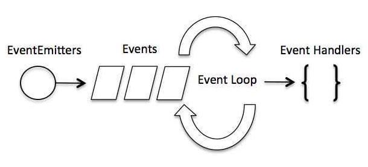

Node js 비동기 프로그래밍
====
### - Multi-Thread 의 한계
Multi-Thread 기반의 서버는 일반적으로 클라이언트의 요청마다 Thread 를 생성시킨다. 그렇기 때문에 요청이 많아지면 Thread 가 많아지며 그만큼 메모리 및 서버 전체에 영향을 크게 미치게 되며 공유자원 사용시 동기화 없이 접근한다면 예기치 못한 결과가 나올 수 있다.

### - 비동기 처리
동기 처리 방식은 하나의 요청이 처리되는 동안 다른 요청이 처리되지 못하며 해당 요청이 완료되어야 다음 요청이 처리되는 방식이다.

비동기 처리 방식은 하나의 요청 처리가 완료되기 전에 제어권을 다음 요청으로 넘겨 처리하는 방식이다. 이 경우 I/O 처리인 경우 Blocking 되지 않으며 다음 요청을 처리할 수 있는 것이다.

**Node js 는 비동기 처리방식으로 병렬처리를 한다.**

## - Node js 의 비동기 처리

Node js 의 비동기 처리는 이벤트 방식으로 처리된다. 
클라이언트의 요청을 비동기로 처리하기 위해 이벤트가 발생하며 서버 내부에 메세지 형태로 전달된다. 이를 서버 내부에서 Event Loop 가 처리한다. Event Loop 가 처리하는 동안 제어권은 다음 요청으로 넘어가고 처리가 완료되면 Callback 함수를 호출하여 처리완료를 호출측에 알린다.

Event Loop는 요청을 처리하기 위하여 내부적으로 약간의 Thread와 프로세스를 사용하며, 이는 Non-Blocking IO 또는 내부 처리를 위한 목적으로만 사용되지 요청 처리 자체를 Thread로 하지는 않는다. 따라서 Node 서버는 Multi-Thread 방식의 서버에 비하여 Thread 수와 오버헤드가 훨씬 적다.

이벤트를 처리하는 Event Loop는 Single-Thread 로 이루어져 있다. 즉 요청 처리는 하나의 Thread 안에서 처리된다는 의미이다. 그래서 이벤트 호출 측에는 비동기로 처리되지만 처리작업 자체가 오래 걸린다면 전체 서버 처리에 영향을 주며, 이는 Node js 의 치명적인 약점이라고 볼 수 있다.

### - Node js 올바른 사용

Node js 는 Google Chrome V8 엔진 기반으로 동작하며 내부의 Event Loop는 Single-Thread 기반에서 비동기 메시지를 처리하며, 이러한 Event Loop는 고성능의 병렬처리를 보장하도록 설계되어 있다. 따라서 이벤트에 의해 처리해야 할 단위 작업이 아주 짧은 시간 안에 처리된다면 Node js의 고성능의 장점을 극대화 할 수 있다.

처리 작업이 CPU를 많이 소모한다든지 대용량 파일을 처리하는 작업보단 I/O 작업이 별로 없는 애플리케이션이나 단위작업이 짧은 메시징 애플리케이션의 경우에 Node js 의 성능이 제대로 발휘 될 수 있다.

따라서 Node 애플리케이션은 가능한 한 전부 비동기로 처리해야 하며 Node 개발자는 비동기 프로그래밍 방식에 익숙해져야 할 필요가 있다.