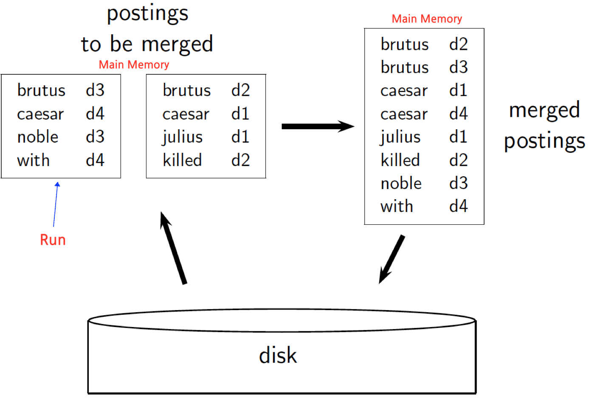
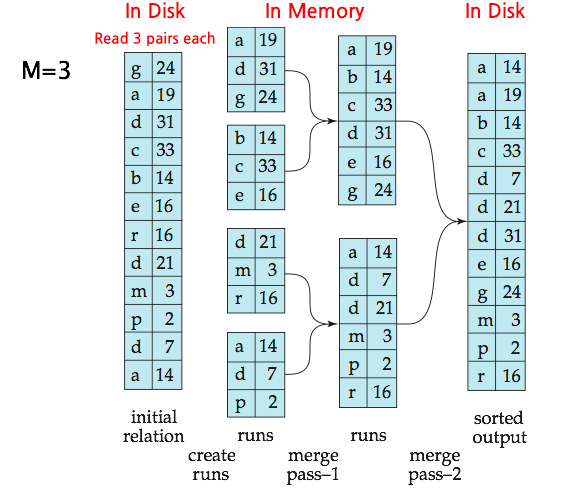
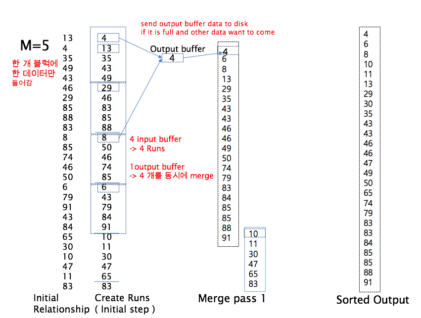
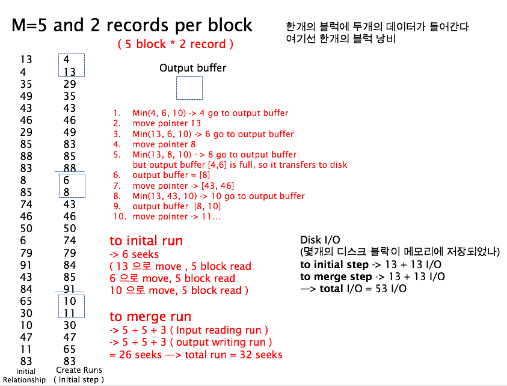
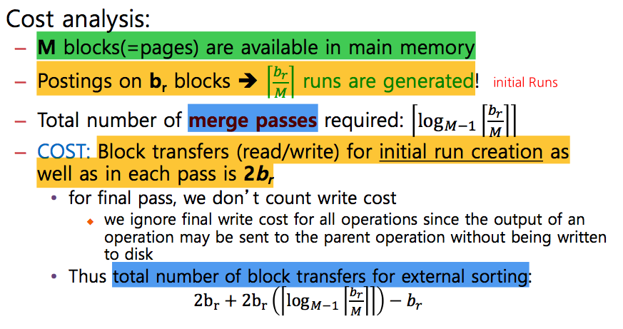
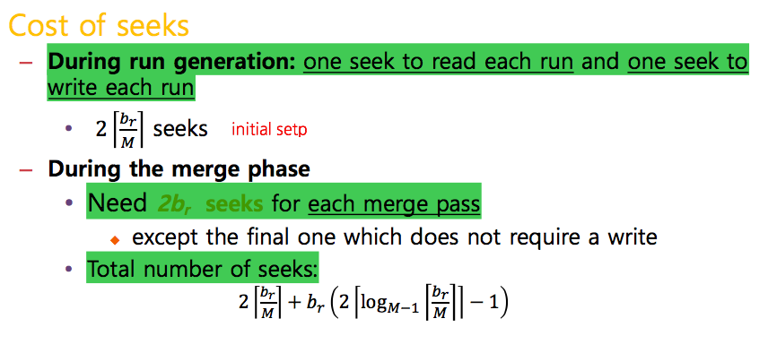
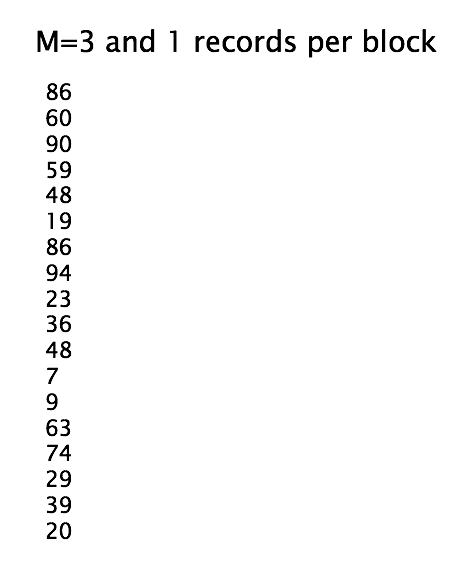

Index Construction
======
- How do we construct an index?
- What strategies can we use with limited main memory?

### - Hardware Basics
- Access to data in memory is much faster than access to data on disk
- **Disk seeks** : No data is transferred from disk while the disk head is being positioned
- **Disk I/O is block-based** : Reading and writing of entire blocks (as opposed to smaller chunks)

### - Can we use the same index construction algorithm for larger collections, but by using disk instead of memory?
- No , too many disk seeks needs ( **Overhead** Increased )
- So, We need an **External Sorting Algorithm**

Blocked Sort-Based Indexing ( BSBI )
-------

**Run : 처음부터 끝까지 Seek 한다 -> 디스크 Seek 한번만 필요하게 저장이 되어q있는 경우** 
Disk 에서 Memory 로 한 Page 씩 읽어들임 **HIT / OS Caching ( 다음에 근처 Data 를 읽을 때 좀 더 빠르게 접근 가능**

External Sorting Using Merge Sort
------

**M : Main Memory 에 들어갈 수 있는 공간** 
Using **Quicksort** in Memory Pairs because mergesort has more memory space than **Quicksort**

#### - Example 1 )

#### - Example 2 )

Cost Analysis
-------

Cost Seek
-------

Exercise
-------

