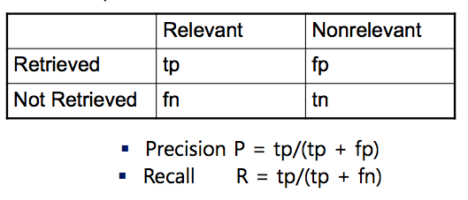
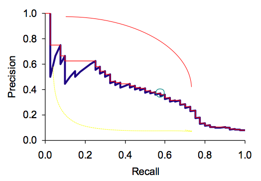
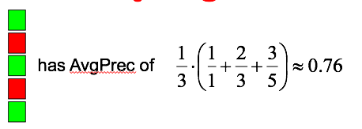
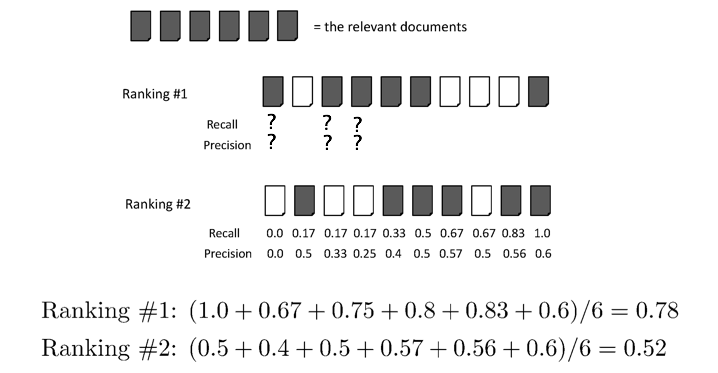

Unranked Retrieval Evaluation
=====

Precision and Recall
-----
### Precision ( 정확도 ) : Fraction of retrieved docs that are relevant  P = relevant / retrieved

Relevant : 검색결과에 포함된 것
Retrieved : 검색결과와 관련된 것

### Recall : Fraction of relevant docs that are retrieved  P = retrieved / relevant

tp : ture positive / fp : false positive 
fn : false negative / tn : ture negative  
ture : is relevant / false : is not relevant 
positive : include docs / negative : do not include docs

Precision@K
-----
- Set a rank threshold K
- Compute % relevant in top K
- Ignores docs ranked lower than K
- Example)
	- 
	- Prec@3 : 2/3 ( top 3개의 docs 중 몇 개가 relevant 한 docs 인가 )
	- Prec@4 : 2/4
	- Prec@5 : 3/5

Recall@K
-----
- Example)
	- 
	- R (relevant docs) = 3 개
	- R@3 = 2/3 (relevant docs 중 몇 개가 relevant 한 docs 인가)
	- R@4 = 2/3

	
Precision - Recall Curve
-----

검색 엔진이 좋은 경우 : 빨간 선
검색 엔진이 나쁜 경우 : 노란 선

Mean Average Precision
-----
- Consider rank position of each **Relevant** docs
- Compute Precision@K for each K1, K2, ... Kr
- **Average Precision = average of P@K**

	**K = 3**

- MAP is Average Precision across multiple queries / rankings

### Average Precision

<pre>
< Ranking #1 >
# of docs = 10
# of relevant docs = 6

R@1 = 1/6
R@2 = 1/6
R@3 = 2/6
R@4 = 3/6
R@5 = 4/6
R@6 = 5/6
R@7 = 5/6
R@8 = 5/6
R@9 = 5/6
R@10 = 6/6

P@1 = 1
P@2 = 0.5
P@3 = 0.67
P@4 = 0.75
P@5 = 0.8
P@6 = 0.83
P@7 = 0.71
P@8 = 0.625
P@9 = 0.56
P@10 = 0.6

Ranking#1 is better than Ranking#2

--> Mean Average Precision = ( 0.78 + 0.52 ) / 2 = 0.65
</pre>

**보통 Relevant 의 Precision 만으로 평균을 낸다.**
