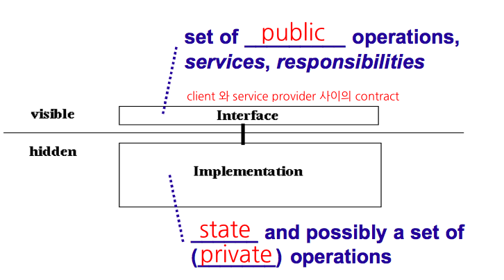

Object-Oriented Paradigm builds on three import concepts
------------
1. **Objcets**
2. **Classes**
3. **Inheritance**
4. (Additional) **Polymorphism**

- Objects have **attributes** that help describe them
 
 
- Objects have externally observable behaviors 
(aka **Services - 사용자관점** or **Responsibilites - 객체관점(Interface, Type)**)
 
 
- Encapsulating state of object rather than expose it is good engineering 
(Encapsulation : separatino of inerface from implementation)
 
 

 
-> don't need to know how object will perform actions, 
&nbsp;&nbsp; But need to know what messages it will understand
 
 
- Objects have **Unique Identities** 
(Identity is property of object distinguishes itself from all other objects) 
-> Don't confuse between the name (or handle) of object and object itself
 
 
- Objects communicate by sending **Messages (Request for action)** 
(Objects perform actions by making requests of each other through **messages**)
 
(there is a designated **Receiver (or target)** that accepts the messages) 
(the actual behavior performed by the receiver may be different, 
depending upon the **Type** of the **Receiver** => **Polymorphrism**) 
*(상속관계에 있는 polymorphrism 은 pure polymorphrism -> 대부분의 polymorphrism)* 
*(Method overloading -> Ad hoc polymorphrism)*
 
- Ask not what you can do to objects, but Ask what objects can do for you
 
 
- Class is a group of ojbects with similar **attributes** and **behavior**
 
 
- Class is a **Repository** for behavior and the internal representation of the associated objects
 
 
- Objects are created from classes through the process of **Instantiation(실체화)**
 
 
- Objects are actual **Instances** of a class 
ex) Classes are factories and objects are products from the factory 
-> the terms **instance** and **object** are **interchangeable**
 
 
- Object can have many types / Ojects of different classes can have same type

