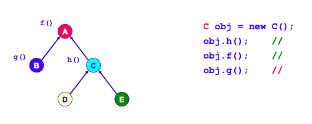
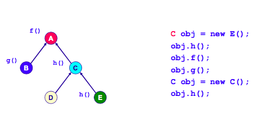

A reference ( or pointer ) variable has two types associated with it
----------------
###- static type 
- the type declared at program 
- fixed and never changed 

###- dynamic type 
- the type of object it actually refers to 
- can be changed during lifetime 

Example)
<pre>
Movie m = new Movie();
m = new JamesBondMovie(); 
JamesBondMovie jm;
jm = new JamesBondMovie();
m = jm; ---> NO ERROR!!
jm = m; ---> ERROR!!
( static type 을 가지고서 판단한다.  jm 의 static type 은 jm 이기 떄문에 자식은 부모의 특성 + @ 를 가지고 있기 때문에 부모는 자식을 포한하는 관계는 아니다.  따라서 jm != m 이다 )
</pre>
&nbsp;
 
A subclasses can be assigned to its superclass, but not vice versa
-----------------
- assign direction
	- super class <---- sub class  &nbsp;&nbsp;O
	- sub class <---- super class  &nbsp;&nbsp;X

 

 
**obj.h(), obj.f() --> O 
obj.g() --> X **
 

**When message is sent to a receiver object, the complier checks its legality by performing an operation lookup using static type**
 

1. static type 의 root 로 올라가 check 
2. static type direction 으로 내려오면서 check 
 
**The compiler searches up starting from the STATIC type util it finds the invoked operation**
 

 
**obj.h() ---> O ( E's h() ) 
obj.f() ---> O ( A's f() ) 
obj.g() ---> X 
obj.h() ---> C's h() **
 

**When message is sent to a receiver, the runtime selects an operation using dynamic type**
 

**The runtime searches up starting from the DYNAMIC type until it finds the first invoked operation**

Actually, the determination of what behavior to perform may be made at compile-time or at run-time
--------------
###- At compile-time 
- Static binding or Early binding 
- Static functions in JAVA / C++ 
- Nonvirtual functions in C++ 

###- At run time 
- Dynamic binding or Late binding 
- Virtual function in JAVA / C++ 