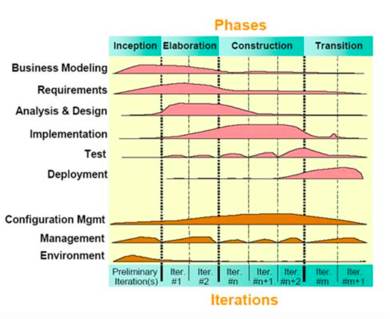
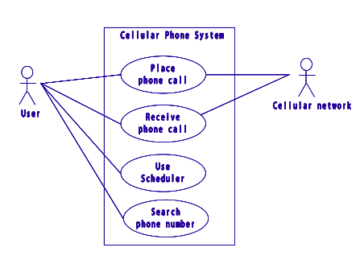
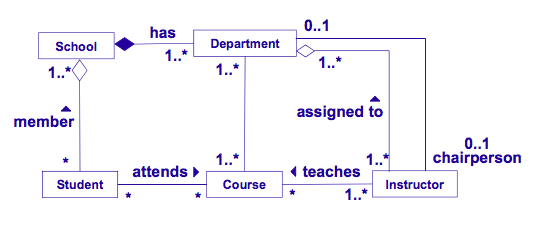
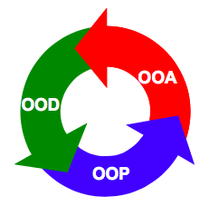
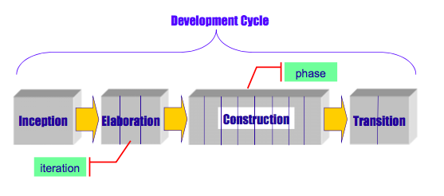

Model
======
### - A Model is a simplification of Reality

### - Models capture the Essential aspects of a system which are relevant to a given level of Abstraction ( 모델 : 필수적 요소만 나타낸것 )

Reasons of using Model
------
1. To **Visualize** a system as it's or as we want it to be
2. To **Specify** the structure or behavior of a system
3. To give a blueprint to **Construct** a system
4. To **Document** the decisions we have made

A Model may be structural or behavioral
---------
### - Static Models ( Structure Models ) Describe a structural prperties of a system
### - Dynamic Models ( Behavior Models ) Describe a behavioral properties of a system
  

Unified Modeling Language (UML 2.0) 
=======
- Visual **Notation** ans semantics
- **Process Independent**
- Not Process, Just Notation

### - Static Models ( Structure Models )
1. Class Diagrams
2. Object Diagrams
3. Component Diagrams
4. Deployment Diagrams
5. Package Diagrams
6. Composite Structure Diagrams

### - Dynamic Models ( Behavior Models )
1. Activity Diagrams
2. Use Case Diagrams
3. State Machine Diagrams
4. Interaction Diagrams 1. Sequence Diagram 2. Communication Diagram 3. Interaction Overview Diagrams 4. Timing Diagrams

Ways of Using UML
----------
- **Different ways in which people want to use UML**
	- UML as sketch
	- UML as blueprint
	- UML as programming language

실질 적으로 대부분 sketch 까지만 진행

- **Forward Engineering**
	- draws a UML diagram before you write code

- **Reverse Engineering**
	- builds a UML diagram from existing code in order to help understand it

  

Unified Process
============

**Inception -> Elaboration -> construction -> Transition** 
각각의 단계에서 달성해야 할 Goal 이 무엇인지 파악하는것이 매우 중요하다.

Object-Oriented Analysis
----------
Analysis emphasizes an **Investigation, Understanding, and Discovery** of the problem domain and requirements what the problem is about and what a system must do 

Analysis dosen't concern how a logical solution is defined 

All the vocalbularies used in the analysis must from the **Problem Domain**

### - Requirement Analysis

 
Investigation of functional & non - functional requirements Functional requirement are captured by **Use-Case Model**

### - Object Analysis

 
Investigation of domain objects, i.e., emphasizing on finding and describing objects (or concepts) in the problem domain Captured by **Domain Model**

Object-Oriented Design
------------
- OOD is primarily a process of **Invention** and **Adaption** of conceptual solution
- OOD tends to be relatively independent of the language used

Object-Oriented Programming
----------

- This corresponds to the implementation discipline
- The classes and class operations are coded, tested, and intergrated

---> There is no one correct representation

Core of the Unified Process (UP)
------------
**Iterative and Incremental** development process using a set of principles and methods based on **Objects** in the **Problem Domain** rather than actions performed by the system

- Iterative Instead of building the entire system as one go, the project has a few or many builds. A build includes only a subset of the entire functionality

- Incremental Software is developed on top of previous build. Make small but noticeable improvements in each iteration

Additional UP Best Practices
------------
- **Tackle high-risk and high-value issues in early iterations ( 어려운 것을 먼저 한다 )**
- Continuously engage users for evaluation, feedback and requirements ( 고객의 요구사항을 지속적으로 수용한다 )
- **Build a cohesive, core Architiecture in early iterations ( 초반에는 응집적이며 중심구조적인 아키텍쳐로 설계한다 )**
- Continuously verify quality; test early, often, and realistically ( 지속적인 테스트를 한다 )
- **Apply Use Cases ( UP 중심에는 Use-Case 가 있다 )**
- Model software visually ( with UML )
- Carefully manage requirements
- Practice change request and configuration management

UP Development Cycle
------------

### 1. Inception
- **Feasibility Phase ( 실현 가능한가? )**
- Establish approximate vision and business case

### 2. Elaboration -> 시스템의 성패를 가르는 가장 중요한 단계
- **Implement core architecture** (시스템의 전체적인 모습이 완성되는 단계이다. )
- 수행 전 고객의 Requirement 의 80 ~ 90% 이상을 알고 있어야한다.
- **Resovle High Risks** ( 리스크 요소가 큰 것부터 해결한다 -> Elaboration 이 끝날때는 High Risk 가 없는게 지향적이다 )

### 3. Construction
- Iterative implementation of the remaining lower risk and easier elements
- Preparation for deployment

### 4. Transition
- Get User Feedback

UP Disciplines and Artifacts
-----------
- A **discipline (관련분야)** is a set of activities (and related artifacts) in one subject area, such as activities in requirements analysis
- An **artifact (discipline 으로 만들어진 결과 산출물)** is the general term used for any work product

Two Desert Island SKills in OOA & OOD
--------
- **Assigning responsibilities to software components**
- **Finding suitable objects or abstraction**