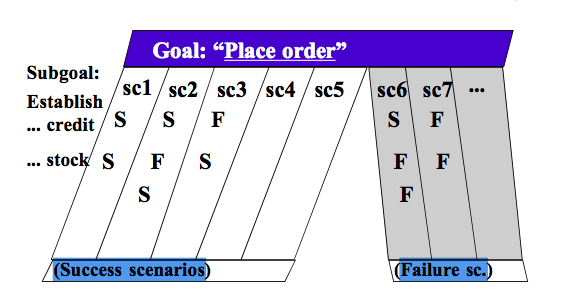
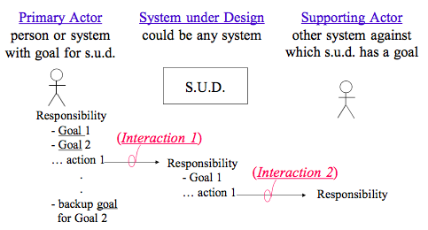

UP Development - 1.Inception (Cont'd)
=======
### - A Use Case contains the set of possible scenarios for achieving a goal

### - The Use Case pulls Goals and Scenarios together, Each scenario says how 1 condition unfolds
- The Use Case **Name** is the goal statement
- **Use Case is goal statement plus the scenarios**
- Use Case : **Goal Statement 와 실현 가능한 시나리오들을 한데 묶은 것이다.**

### - Scenario 들을 묶은 것은 성공과 실패로 이루어져 있다.

### - Business UC vs System UC
- Business UseCase : **Describe the operations of the business**
- System UseCase : **Describe the functional requirement for the SuD ( System Under Design )**

### - Black Box UC vs White Box UC
- Black Box UseCase 
	- **System 을 모르는 상태**
	- Do not describe the internal workings of the system, its components, or design
- White Box UseCase
	- **System 을 아는 상태**
	- Can describe the internal workings of the system, its components, or design
	- Business process designers may write **white-box business usecase** to show how the company or organization runs its internal process

### - Use Case Formats
- **Brief Format**
	- 간결한 one-paragraph summary
	- usually of the main success scenario
	- created in early requirements phase to understand the degree of complexity and functionality in a system
- **Casual Format**
	- Informal ( 약식의 ) parargraph format
	- Multiple paragraphs that cover various scenarios
- **Fully Dressed Format**
	- The most elaborate ( 가장 정교함 )
	- All steps and variations are written in detail
	- there are supporting sections, such as preconditions and success guarantess. ( 성공 조건과 전제조건 같은 부가 섹션이 정의되어 있다 )

### - The Use Case is a behavioral part of the contract between various stakeholders

- Stakeholder : The stakeholder who or which initiates an interaction with the SuD or calls upon system services to achieve a goal.
- An Action or an **Interaction** between two **Actors with Goals**
- What the system must do internally to protect the **Stackholders with interests**

### - The basic model of Use Cases is that Actors interact to achieve their goals

**Main Goal 을 성취하기 위해서는 Sub Goal 을 먼저 성취하여야 한다**

### - The System protects the interests of all the stackholders

### - A Use Case can be viewed as a behavioral contract between stakeholders with interests
- The **Actors and Goals** model explains how to write sentences in use case, but it **Does not cover the need to describe the Internal behavior** of the system under discussion
- We need to extend the Actors and Goals model to **Stakeholders and Interests** model
- Stakeholders and Interests model identifies what to include in the UseCase

### - To satisfy the interests of the stakeholders, we need to describe three sorts of actions
- **An Action or Interaction between two actors( to further a goal )**
- **A validation ( to protect the interest of one of the stakeholders )**
- **An internal state change ( on behalf of a stakeholder also to protect or further an interest of a stakeholder )**

### - Primpary Acotr 도 Stakeholder 이다.

### - Preconditions and Postconditions
- **Preconditions** state what must always be true before beginning a scenario in the Use Case. They are conditions that are assumed to be true ( UseCase 가 실행되기 전 실행해야 하는 것 )
- **Postconditions** state what must be true on successful completion of the Use Case, regardless of its path ( 사전 조건이 만족되었을때 UseCase 가 끝나고 실행되어야 할 것 )

