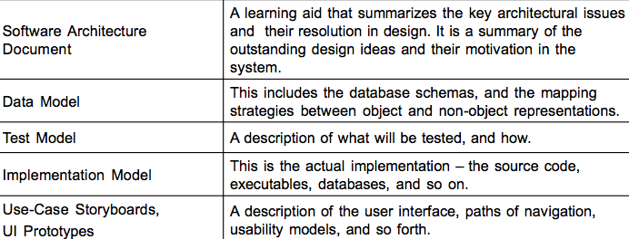
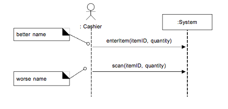
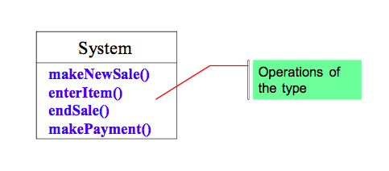
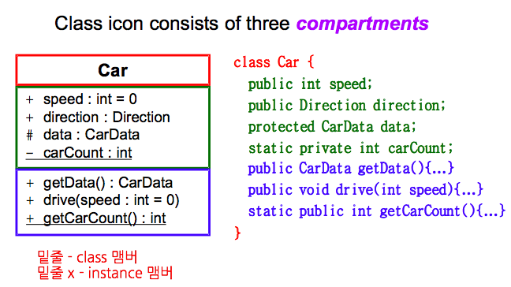

UP Development - 2.Elaboration
=====
Build the core architecture, resolve the high-risk elements, define most requirements, and estimate overall schedule and resources
-----

### - Elaboration is the initial series of iterations during which : the follwing content
- The majority of requirements are discovered and stabilized
	- 70 ~ 80 % 의 requirements 는 수용되어야 한다.
	- wirte most of the Use Cases and other requirements in detail
- The marjor **Risk** are mitigated or retired. ( **기술 / 비지니스 관점에서 대다수의 위험성은 해결되어야 함** )
- The core **Architectural** elements are implemented and proven. ( **System 의 중요한 architectural 는 어느 정도 구현되고 안정되어 있어야 한다** )

### - Elaboration Phase
- Elaboration consists of between two and four iterations
	- each iteration is recommended to between two and six weeks, unless the term size is massive
- Each iteration is timeboxed, meaning its end date is fixed
- At the end of each iteration, stable and tested **Production-Quality** portions of the final system must be released ( 각각 iteration 마지막 부분에서, Final system 의  안정적이고 검증된 Production-Quality 부분은 반드시 해결되야 한다. )

### - What is Architecturally Singificant in Elaboratoin?
- Employing **Wide and Shallow** design and implementation.
	- Implementing simplified and End to End scenarios that force design, implementation, and test across major components.
- Integrating existing componets

### - Planning the Next Iteration
- Organize requirements and iterations by **Risk, Coverage, and Criticality**
- **Risk**
	- Includes Both technical complexity and other factors, such as uncertainty of effort or usablity
- **Coverage**
	- Implies that all major parts of the system are at least touched on in early iterations
- **Criticality**
	- Refers to functions of high business value

==> &nbsp;**3가지에 Weight 를 부여하여 높은 순서대로 먼저 수행한다.**

### - Artifacts that May Start in Elaboration
- **Domain Model** : This is a visualization of the domain concepts; it is similar to a static information model of the domain entities ( static / dynamic model )
- **Design Model** : This is the set of diagrams that describe the logical design, This includes software class diagram, object interaction diagram, packgae diagrams, and so forth

Drawing System Sequence Diagrams
--------
#### - Objectives
- Identify system events and system operations.
- Create system sequence diagram for Use Cases.

### - SSD ( System Sequence Diagrams )
- **System behavior** is a description of **What** a system does, without explaning **How** it does it
- **System Sequence Diagram** captures the system behavior, for a particular scenario of a Use Case, by illustrating the events that external actors generate to SuD, their order, and inter-system events
	- It allows us to treat the system as a **BLack Box**
- System Sequence Diagram emphasizes those events that **Cross** the system boundary from actors to systems
- **System Sequence Diagram should be done for the main success scenario of the Use Case, and frequent or complex alternative scenarios**

### - System Events & System Operations
- **System event** is an external event generated by an external actor to a system ---> **Stimulus**
- **System operation** is an operation of the system that executes in response to a system event ---> **Response**
	- The set of all required system operations is determined by identifying the system evnets. The system events are derived from Use Case ( **System 외부에서  Event 가 주어졌을때 해당 Event 에 대한 System 이 취한 동작** )

- System Sequence Diagram shows system events for a scenario of a Use Case, therefore it is generated from inspection of a Use Case

### - Naming System Events / Operations
- System events and theri associated events should be **Expressed at the (highest) level of Intent** rather than in terms of physical input medium or interface widget
- Usually start with a "Verb" like add, enter, make ...

#### - Showing Use Case Text
- The text provides the details and context the diagram visually summarizes the interaction

#### - Recording System Operations & Class Icon
- UML class icon provides a compartment to record operations for a type

### - How To Make System Sequence Diagram
1. **Draw a line representing the system as a black box**
2. **Identify each actor that directly operates on the system Draw a line for each such actor**
3. From the Use Case main success scenario text, **Identify the system ( External ) events that each actor generates. illustrate them on the diagram**
4. **Optionally, include the Use Case text to the left of the diagram**

