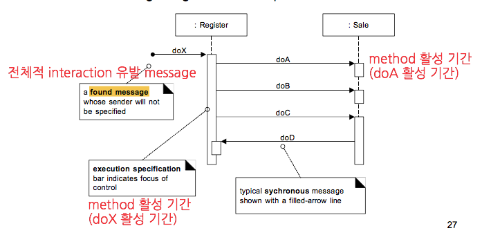
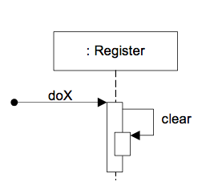
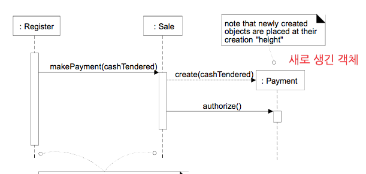
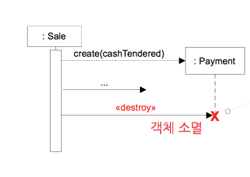
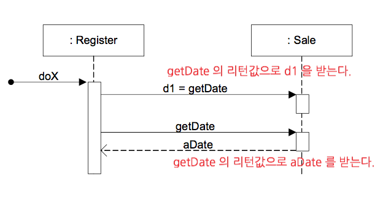
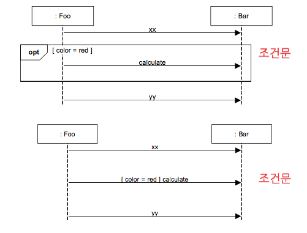
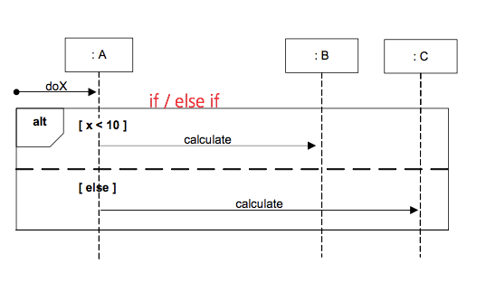
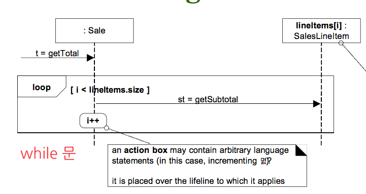
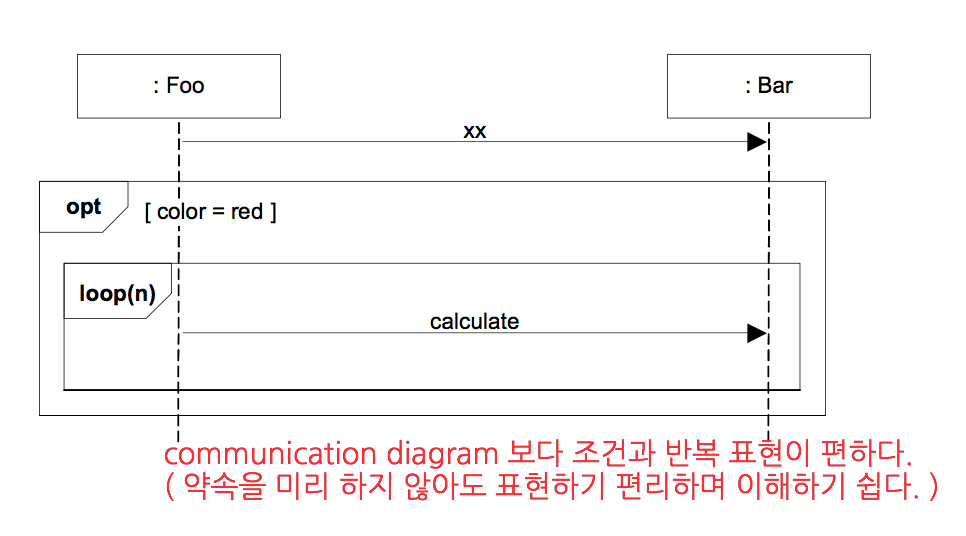
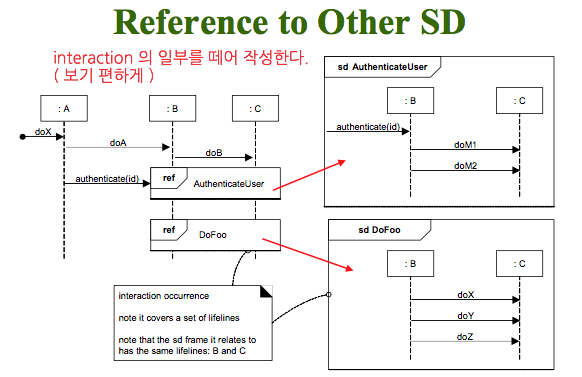

UP Development - 3.Construction (Cont'd)
=====

2.Sequence Diagram
====

### Illustrating Messages

- **Self Message**

자기 자신에게 보내는 message 표기법

- **Object Creation & Deletion**

객체 생성 및 제거 표시법

- **Return Value**

- **Conditional Messages**

- **Iteration or Looping**

- **Condition & Looping**

#### Reference to Other SD

