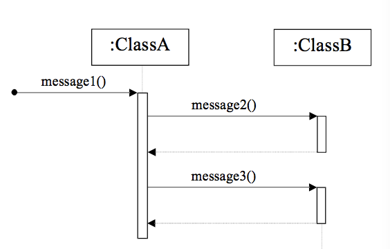
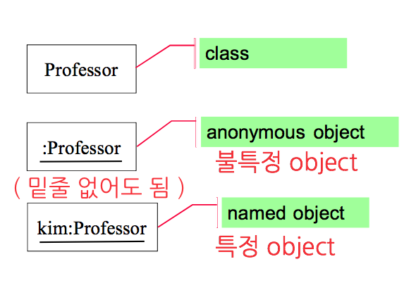
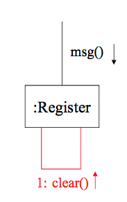
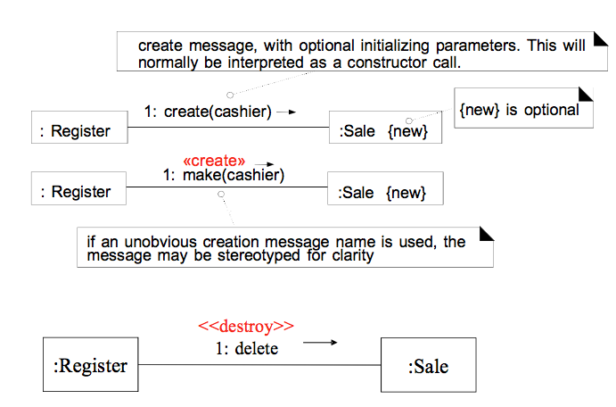
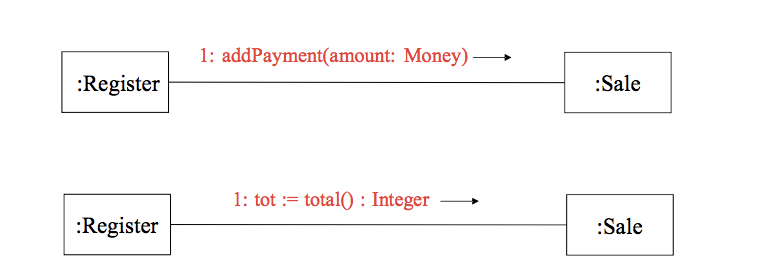
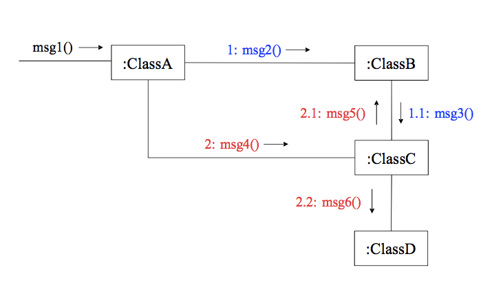
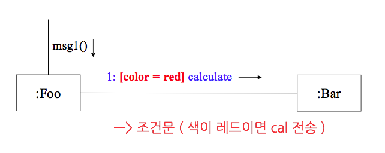
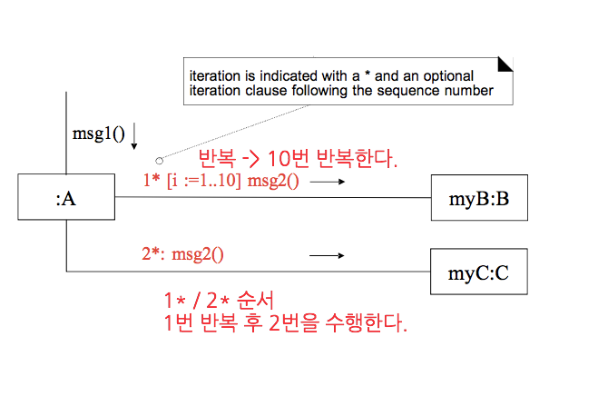
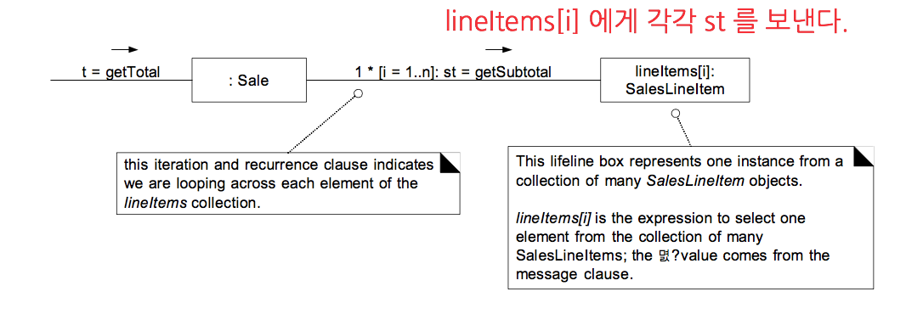
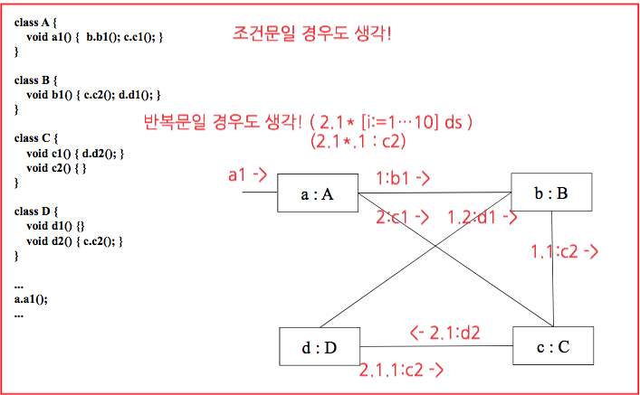

UP Development - 3.Construction
=====

### Design Phase
- the design phase focuses on questions of **how** -- how the system fulfills the requirements
- the design phase emphasizes a **logical solution** from the perspective of objects ( and interfaces )
- the heart of the solution is the creation of the following two diagrams, which are part of the **Design Model** in UP.
	- **Interaction Diagrams**
		- How objects communicate, dynamic aspects
	- **Class Diagram**
		- static object relationships, static aspect

( 구조적 측면의 Solution - Class Diagram ) 
( 행동적 측면의 Solution - Interaction Diagram )

## Interaction Diagram

### Sequence Diagram
- Focuses on the **Time**
- order in which the messages are sent
- 참여 객체가 많아지면 표현 공간이 많이 필요

### Communication Diagram
- Focuses on the **Space**
- relationships between objects
- sequence diagram 과 보여주는 것은 같지만
표현 공간을 절약시켜준다. 
-> 시간의 축이 없기때문에 메시지에 번호를 부여하여
순서를 판단한다.
- 표현 공간이 덜 필요

### UML Object Icons

1. Communication Diagram
====

### Illustrating Messages

**메세지간의 인과관계를 부여하기 위해 k 번 메세지의 응답을 k.1 , k.2 … 로 표현한다.**

- **Self Message**

자기 자신에게 보내는 message 표기법

- **Object Creation & Deletion**

객체 생성 및 제거 표기법

- **Return Value**

--> 리턴값의 타입은 Integer 이며 total() 함수의 리턴 값으로 tot 를 받는다.

### Message Number Sequencing

**( Unconditional Message )** 
**메세지간의 인과관계를 부여하기 위해  k 번 메세지의 응답을 k.1 , k.2 … 로 표현한다.**

<pre>
msg1 : trigger message (최초 메세지)
1 / 1.1 msg 가 끝나면 2: msg4() 가 동작

—> :classD 에서 메소드를 하나 더 생성한다면 
2.2 msg 로 부터 classD 가 생성되었기 때문에 2.2.1 부터 부여한다.
</pre>

**Sudo Code**

<pre>
class ClassA {
    msg1() {
        b.msg2();
        c.msg4();
    }
}
class ClassB {
    msg2() {
        c.msg3();
    }
    …
}
class ClassC {
    msg4() {
        b.msg5();
        d.msg6();
    }
}
…
</pre>

- **Conditional Messages**

- **Iteration or Looping**

<pre>
1.
for () {
  msg1()
  msg2()
}

2.
for () {
  msg1()
}
for () {
  msg2()
}

—> 구분하는 방법 ( 미리 약속을 정해서 구분해야 한다)
—> Communication Diagram 의 취약점

</pre>

- **Illustrating Iterations**

#### Example

